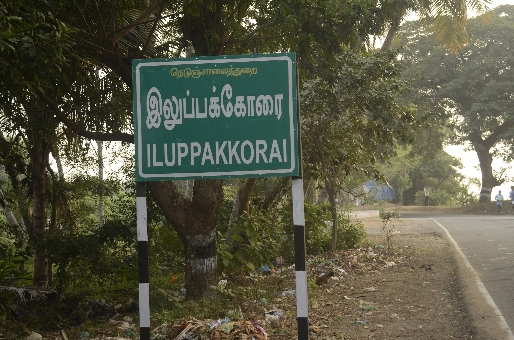
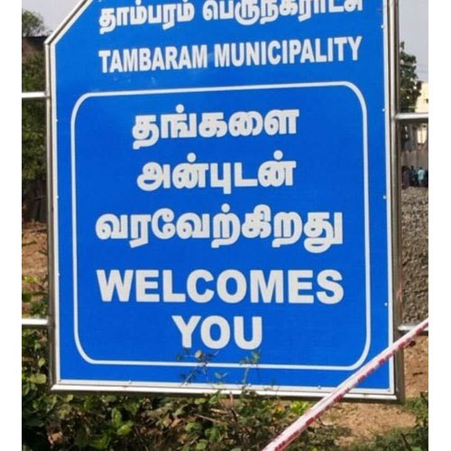

# tamil_ocr
## Tamil OCR 

Finetuned version of PARSEQ model on Tamil text. This works best for text present in everday's life (scene texts) and needs finetuning on the Document part (better to use Tesseract if document is clear). This model is work in progress, feel free to contribute!!!

Tamil OCR involves two step process
1. Text Detection by CRAFT text detection model
2. Text prediction by PARSEQ

Currently supports two languages (English + Tamil). Accuracy of the model can be improved by adjusting the Text detection model and further finetuning on the required text using Parseq.

## How to use
1. Clone the repository
2. Pip install the required modules using
   ``` pip install -r requirements.txt```
4. Download the models weights from the [GDRIVE](https://drive.google.com/drive/folders/1oMxdp7VE4Z0uHQkHr1VIrXYfyjZ_WwFV?usp=sharing) and keep it under model_weights 
    
        |___model_weights
            |_____craft_mlt_25k.pth
            |_____parseq_tamil_v4.ckpt
    
5. Run the below code by providing the path

```python
from inference import ocr_predict

image_path = ""
texts = ocr_predict(image_path)
print(texts)

```

## Samples


#### output: இலுப்பக்கேரை நெடுஞ்சாலைத்துறை ILUPPAKKORAI ள்




#### output: தாம்பரம் பெருநகராட்சு TAMBARAM MUNICIPALITY WELCOMES பிரத்தன்

## Thanks to the below contibuters for making awesome Text detection and text recognition models

```bibtex
@InProceedings{bautista2022parseq,
  title={Scene Text Recognition with Permuted Autoregressive Sequence Models},
  author={Bautista, Darwin and Atienza, Rowel},
  booktitle={European Conference on Computer Vision},
  pages={178--196},
  month={10},
  year={2022},
  publisher={Springer Nature Switzerland},
  address={Cham},
  doi={10.1007/978-3-031-19815-1_11},
  url={https://doi.org/10.1007/978-3-031-19815-1_11}
}
```

```bibtex
@inproceedings{baek2019character,
  title={Character Region Awareness for Text Detection},
  author={Baek, Youngmin and Lee, Bado and Han, Dongyoon and Yun, Sangdoo and Lee, Hwalsuk},
  booktitle={Proceedings of the IEEE Conference on Computer Vision and Pattern Recognition},
  pages={9365--9374},
  year={2019}
}
```
